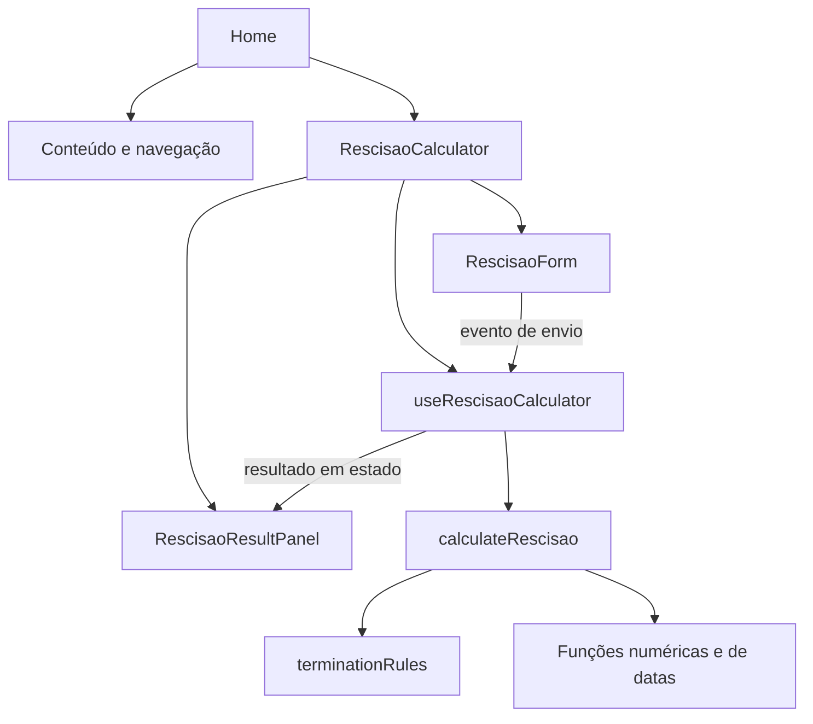
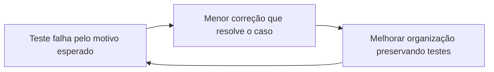

# Curso prático: construindo e entendendo o Calcula Rescisão

Este curso explica o projeto que desenvolvemos, da primeira página à separação de responsabilidades, passando pelo tema escuro, cálculos, testes com Jest e correções com TDD.

Você vai aprender programação usando uma aplicação real. As fórmulas mostradas descrevem **o modelo implementado**, com suas simplificações; não são uma aula de legislação nem uma validação contábil.

## Como estudar

Você pode começar sabendo pouco de React. É útil ter noções de arquivos, pastas e terminal. Nas primeiras aulas, explicamos também a sintaxe de JavaScript e TypeScript usada pelo projeto.

Reserve aproximadamente 15 a 22 horas, incluindo exercícios. Essa é uma sugestão de ritmo, não uma exigência.

1. Leia uma aula e abra os arquivos indicados.
2. Reescreva um exemplo pequeno sem copiar.
3. Faça o exercício em uma branch de estudo.
4. Compare com o gabarito somente depois de tentar.
5. Execute os testes antes de considerar uma alteração concluída.

**Legenda dos exemplos:** “código atual” corresponde à implementação do repositório; “exemplo didático” simplifica uma ideia; “exercício” propõe uma mudança que ainda não está implementada. Não substitua arquivos completos por trechos parciais.

Os caminhos dos arquivos neste curso são relativos à pasta `calcula-recisao`, que contém `package.json`. Os comandos de terminal também partem dessa pasta, salvo indicação diferente.

## Trilha de aulas

| Aula | Assunto | Tempo sugerido |
| --- | --- | --- |
| [1](#aula-1) | Produto e limites | 30 min |
| [2](#aula-2) | Ambiente, npm e comandos | 45 min |
| [3](#aula-3) | JavaScript e TypeScript do projeto | 90 min |
| [4](#aula-4) | Next.js, páginas e componentes | 60 min |
| [5](#aula-5) | Separação de responsabilidades | 60 min |
| [6](#aula-6) | Estado e hooks | 75 min |
| [7](#aula-7) | Formulário e acessibilidade | 60 min |
| [8](#aula-8) | Funções de cálculo | 90 min |
| [9](#aula-9) | Datas e bugs reais | 90 min |
| [10](#aula-10) | Regras e serviço | 60 min |
| [11](#aula-11) | Resultado e dinheiro | 45 min |
| [12](#aula-12) | CSS, identidade visual e responsividade | 90 min |
| [13](#aula-13) | Testes unitários com Jest | 75 min |
| [14](#aula-14) | Testes de integração | 75 min |
| [15](#aula-15) | TDD e cobertura | 60 min |
| [16](#aula-16) | Git e Conventional Commits | 45 min |
| [17](#aula-17) | Documentação, Swagger e evolução | 45 min |
| [18](#aula-18) | Projeto final e gabarito | 90 min |

<a id="aula-1"></a>
## Aula 1 — Comece pelo problema do usuário

### Objetivo

Entender por que construímos essa ferramenta e como isso influencia o código e a interface.

A pessoa que acessa o site quer uma primeira noção da rescisão e perguntas melhores para conversar com o RH ou com um profissional. Não prometemos um cálculo definitivo.

Isso aparece em decisões concretas:

- O botão diz “Simular minha rescisão”.
- O resultado diz “Total estimado”.
- Há um aviso antes da simulação e outro próximo ao resultado.
- A página tem orientações e perguntas frequentes.
- A calculadora funciona sem cadastro.

Abra [a apresentação](../../app/components/home/hero-intro.tsx) e [o resultado](../../app/components/calculator/rescisao-result.tsx).

**Exemplo didático de critério de aceite:**

> Quando o usuário preencher os dados válidos e enviar o formulário, deve visualizar as parcelas e um total identificado como estimativa.

Um critério de aceite descreve algo observável. “A página deve ser boa” é vago. “O resultado deve apresentar o aviso de estimativa” pode ser verificado.

### Evolução que fizemos

A página começou como um formulário centralizado. Depois ganhou cabeçalho, apresentação, guia e rodapé. Testamos uma direção clara e verde, passamos a grafite com lavanda e chegamos ao grafite com azul mais forte. Por fim, colocamos a calculadora junto da apresentação e removemos elementos ilustrativos que ocupavam esse espaço.

A lição: mudar cor altera o clima, mas mudar composição altera a prioridade do conteúdo.

### Exercício 1

Escreva três critérios de aceite: um para o formulário, um para o resultado e um para o texto informativo.

<a id="aula-2"></a>
## Aula 2 — Prepare o ambiente e entenda o npm

### Objetivo

Saber instalar, executar e verificar a aplicação.

No terminal, partindo da pasta externa do repositório:

```bash
cd calcula-recisao
node --version
npm --version
npm ci
npm run dev
```

Abra `http://localhost:3000`. Se a porta estiver ocupada, confira a URL informada pelo terminal. Para encerrar o servidor, use `Ctrl+C`.

`npm ci` instala com base no lockfile e substitui a pasta de dependências instalada. Use-o em uma instalação limpa ou quando quiser reproduzir as versões registradas. `npm install` é usado, por exemplo, ao adicionar uma dependência e atualizar o lockfile.

### Arquivos essenciais

| Arquivo | Para que serve |
| --- | --- |
| `package.json` | Dependências e comandos do projeto |
| `package-lock.json` | Resolução concreta das dependências, inclusive transitivas |
| `tsconfig.json` | Opções do compilador TypeScript |
| `next.config.ts` | Configuração do Next.js |
| `eslint.config.mjs` | Regras de análise do código |
| `.gitignore` | Arquivos que não devem entrar no Git |

No manifesto desta versão, usamos Next `16.3.4`, React `19.2.8`, TypeScript `^5` e Jest `^30.5.1`. Consulte o manifesto e o lockfile quando isso mudar. O `^` permite atualizações compatíveis segundo a faixa declarada; o lockfile registra a versão resolvida.

Zod está instalado, mas **não foi integrado à validação do serviço**. Instalar uma biblioteca não significa usá-la.

### Comandos que você deve conhecer

```bash
npm run dev              # desenvolvimento com atualização ao editar
npm run build            # gera o build de produção
npm start                # serve o build já gerado
npm test                 # executa os testes uma vez
npm run test:watch       # acompanha alterações nos testes/código
npm run test:coverage    # testes e relatório de cobertura
npm run lint             # análise com ESLint
npx tsc --noEmit          # verifica tipos sem emitir JavaScript
```

Os scripts de teste usam `TZ=America/Sao_Paulo`, sintaxe de Linux/macOS/WSL. No PowerShell, para uma execução equivalente, defina `$env:TZ="America/Sao_Paulo"` e rode `npx jest --runInBand`.

Os testes não substituem o build, e o build não substitui os testes. Cada comando verifica uma dimensão diferente. O carregamento de fontes pelo Next pode exigir rede no build.

### Exercício 2

Execute os testes e encontre a definição de `test:coverage` em `package.json`. Explique o que o comando faz sem usar a palavra “mágica”.

<a id="aula-3"></a>
## Aula 3 — JavaScript e TypeScript lendo o código real

### Objetivo

Entender a sintaxe necessária para acompanhar o restante do curso.

### Variáveis e funções

**Exemplo didático:**

```ts
const salary = 3000;
let months = 0;
months++;

function proportionalSalary(value: number, count: number): number {
  return (value / 12) * count;
}

proportionalSalary(salary, 6); // 1500
```

`const` impede reatribuir a variável. `let` permite reatribuição. `months++` soma um. `: number` declara o tipo esperado; o tipo depois dos parênteses descreve o retorno.

A função recebe dados, calcula e devolve o resultado com `return`. Ela não precisa saber onde o valor será exibido.

### Objetos e propriedades

```ts
const input = { salary: 3000, fgtsBalance: 10000 };
const amount = input.salary;
```

`input.salary` lê uma propriedade. O objeto reúne valores relacionados sob nomes claros.

### União de valores permitidos

Abra [os tipos](../../app/types/recisao.ts). O tipo `TerminationType` limita os textos aceitos:

```ts
export type TerminationType =
  | 'demissaoSemJustaCausa'
  | 'pedidoDemissao'
  | 'rescisaoIndireta'
  | 'rescisaoPorJustaCausa'
  | 'rescisaoPorAcordo'
  | 'rescisaoPorFalecimento';
```

É uma união de literais. Uma variável desse tipo não aceita qualquer texto durante a verificação TypeScript.

```ts
const type: TerminationType = 'pedidoDemissao';
// const wrong: TerminationType = 'qualquerCoisa'; // erro de tipo
```

### Interfaces: o formato dos dados

```ts
export interface RescisaoInput {
  salary: number;
  admissionDate: Date;
  terminationDate: Date;
  terminationType: TerminationType;
  fgtsBalance: number;
}
```

A interface define os campos necessários. Ela ajuda o editor e o compilador, mas desaparece no JavaScript gerado. Uma entrada maliciosa ou inválida em tempo de execução não é barrada apenas por uma interface.

### Condicional e operador ternário

```ts
const amount = hasThirteenthSalary
  ? calculateThirteenthSalary(salary, months)
  : 0;
```

Se a condição for verdadeira, use o cálculo; caso contrário, use zero. É a forma curta de um `if/else` que escolhe um valor.

### Desestruturação, rest e spread

Código atual do componente da calculadora:

```ts
const { result, ...form } = useRescisaoCalculator();
```

Retira `result` do objeto e guarda as demais propriedades em `form`. O `...` aqui é rest: coleta o restante.

```tsx
<RescisaoForm {...form} />
```

No JSX, o `...` é spread: repassa as propriedades para o componente. É equivalente a escrever cada prop individualmente.

### Tipos utilitários

Código atual do formulário:

```ts
type RescisaoFormProps = Omit<ReturnType<typeof useRescisaoCalculator>, 'result'>;
```

Leia de dentro para fora:

1. `typeof useRescisaoCalculator`: obtém o tipo da função.
2. `ReturnType<...>`: obtém o tipo do objeto retornado.
3. `Omit<..., 'result'>`: remove a propriedade que o formulário não precisa.

Isso evita repetir todos os tipos. A contrapartida é que o contrato do formulário depende do retorno do hook. Em um componente muito reutilizável, uma interface própria pode ser mais estável.

### Imports

```ts
import { calculateRescisao } from '@/app/services/calculate-recisao';
import type { RescisaoResult } from '@/app/types/recisao';
```

O primeiro importa uma função utilizada em execução. O segundo só importa um tipo. O alias `@/*` aponta para a raiz do projeto em `tsconfig.json`; ele não é um caminho especial que o JavaScript conhece sozinho.

### Exercício 3

Crie, em um arquivo de estudo, uma interface com `description: string` e `amount: number`. Escreva uma função que recebe esse objeto e retorna apenas `amount`.

<a id="aula-4"></a>
## Aula 4 — Next.js, React, layout e página

### Objetivo

Entender como arquivos viram interface.

Abra [a página](../../app/page.tsx) e [o layout](../../app/layout.tsx).

No App Router do projeto:

- `app/page.tsx` representa a página `/`.
- `app/layout.tsx` fornece a estrutura compartilhada, incluindo `<html>` e `<body>`.
- Os arquivos em `components` são importados; eles não viram páginas só por existir.

### Um componente React

**Exemplo didático:**

```tsx
function Welcome({ name }: { name: string }) {
  return <p>Olá, {name}.</p>;
}

export default function ExamplePage() {
  return <Welcome name="Ana" />;
}
```

A função devolve JSX, uma sintaxe para descrever a interface. Chaves inserem expressões JavaScript no JSX. `name` é uma prop, isto é, uma entrada do componente.

### Server Component e Client Component

Nossa página não tem `'use client'`: ela compõe conteúdo sem manter estado interativo. `RescisaoCalculator` tem essa diretiva e importa o hook e os componentes interativos.

```tsx
'use client';
```

A diretiva estabelece a fronteira cliente. Não precisamos repeti-la em cada descendente importado pela calculadora. Client Components também podem participar da geração inicial de HTML no servidor; a diretiva não significa “nunca passa pelo servidor”.

No navegador, a hidratação conecta o comportamento React ao HTML inicial. É o que permite que eventos e estado controlem a interface.

### Layout, idioma e metadados

O layout usa `lang="pt-BR"`, que informa o idioma para navegadores e tecnologias assistivas. Também exporta `metadata` com título e descrição.

As fontes Geist e Geist Mono vêm de `next/font/google` e disponibilizam variáveis CSS. Metadados ajudam a descrever a página, mas não garantem posicionamento em buscadores.

### Exercício 4

Identifique qual arquivo deve mudar em cada caso: título da aba, texto de apresentação, reação ao clique no botão.

<a id="aula-5"></a>
## Aula 5 — Separe responsabilidades sem fragmentar demais

### Objetivo

Saber onde colocar uma alteração.

```text
app/
├── page.tsx
├── layout.tsx
├── components/
│   ├── layout/       cabeçalho e rodapé
│   ├── home/         apresentação, etapas, guia e perguntas
│   └── calculator/   formulário, resultado e composição
├── hooks/           estado da calculadora
├── services/        orquestração dos cálculos
├── rules/           configurações das modalidades
├── types/           contratos TypeScript
├── utils/           operações numéricas e calendário
└── styles/          layout, home, calculadora e responsividade
```

Antes, `page.tsx` concentrava tudo. Agora ela organiza os blocos. Isso permite editar uma pergunta frequente sem mexer no cálculo e testar a contagem de meses sem montar uma página React.



Não crie uma pasta nova para cada linha. Separe quando existir uma responsabilidade compreensível e uma razão para aquele trecho mudar independentemente.

| Mudança | Lugar adequado |
| --- | --- |
| Texto de uma orientação | `components/home` |
| Borda do formulário | `styles/calculator.css` |
| Valor digitado | Hook |
| Contagem de meses | Utilitário de calendário |
| Inclusão de uma parcela conforme modalidade | Regras e serviço |
| Formato de entrada | Tipos e validação correspondente |

### Exercício 5

Explique por que uma função de cálculo não deve procurar o salário com `document.querySelector`.

<a id="aula-6"></a>
## Aula 6 — Estado e o hook da calculadora

### Objetivo

Acompanhar a informação enquanto o usuário preenche o formulário.

Abra [o hook](../../app/hooks/use-rescisao-calculator.ts).

```ts
const [salary, setSalary] = useState('');
```

`salary` é o valor da renderização atual. `setSalary` solicita a atualização do estado e uma nova renderização. Não é uma atribuição imediata à variável local já existente.

Por que uma string para dinheiro? O campo pode estar vazio enquanto a pessoa digita. O DOM fornece `event.target.value` como texto, mesmo em `type="number"`.

```ts
const [result, setResult] = useState<RescisaoResult | null>(null);
```

`null` representa “ainda não há resultado”. Depois do cálculo, o estado passa a conter um objeto com as parcelas.

### O caminho do envio

Código atual, reduzido à parte principal:

```ts
const rescisao = calculateRescisao({
  salary: Number(salary),
  admissionDate: new Date(`${admissionDate}T00:00:00`),
  terminationDate: new Date(`${terminationDate}T00:00:00`),
  terminationType,
  fgtsBalance: Number(fgtsBalance),
});
setResult(rescisao);
```

1. O hook converte os campos para o contrato do serviço.
2. O serviço devolve a estimativa.
3. O hook salva o resultado.
4. O React renderiza o painel.
5. Os setters limpam os campos e restauram a modalidade inicial.

O cálculo é síncrono: não há `fetch`, banco de dados ou promessa nesse fluxo. Não inventamos estado de carregamento para uma chamada de rede inexistente.

### O que o hook não deve fazer

Ele não define como calcular férias, não contém CSS e não escolhe o texto de cada orientação. Ele coordena estado e conversão dos campos.

A limpeza dos campos é o comportamento atual, não uma obrigação do React. Para manter os dados após calcular, a mudança seria no hook, acompanhada da alteração consciente do teste de comportamento.

### Exercício 6

Explique o que apareceria na tela se nunca chamássemos `setResult`, mesmo que o serviço calculasse corretamente.

<a id="aula-7"></a>
## Aula 7 — Formulário controlado e acessível

### Objetivo

Entender campos, eventos, validação HTML e acessibilidade.

Abra [o formulário](../../app/components/calculator/rescisao-form.tsx).

```tsx
<label htmlFor="salary">Salário bruto</label>
<input
  id="salary"
  type="number"
  required
  min="0"
  step="0.01"
  value={salary}
  onChange={(event) => setSalary(event.target.value)}
/>
```

`htmlFor` e `id` associam a descrição ao campo. Isso permite usar o rótulo para localizar o campo nos testes e ajuda tecnologias assistivas. Placeholder é uma dica e não substitui label.

O campo é **controlado** porque seu valor vem do estado React. `onChange` atualiza esse estado em resposta à digitação.

### Validação HTML

- `required`: exige preenchimento.
- `min="0"`: rejeita números negativos; zero continua permitido.
- `step="0.01"`: define incrementos centesimais válidos.
- `min={admissionDate || undefined}`: a saída não pode anteceder a admissão preenchida.

O navegador valida o formulário antes do envio normal. O serviço, porém, pode ser chamado diretamente por outro código. Por isso validação HTML não equivale a validação de domínio.

### Envio

```tsx
<form onSubmit={(event) => {
  event.preventDefault();
  handleCalculate();
}}>
```

`preventDefault()` evita a navegação/recarregamento do envio HTML tradicional. O botão `type="submit"` participa do formulário, inclusive do envio pelo teclado.

### Modalidade

O `<select>` contém os seis valores de `TerminationType`. A expressão `as TerminationType` informa um tipo ao compilador, mas não verifica a string em execução. Aqui os valores vêm das opções declaradas; uma futura entrada externa exigirá validação real.

### Exercício 7

Use apenas Tab e Enter para preencher e enviar. Confira se o foco é visível. Depois remova o salário e confirme que não aparece um novo resultado.

<a id="aula-8"></a>
## Aula 8 — Funções puras e cálculos pequenos

### Objetivo

Aprender a decompor cálculos em operações verificáveis.

Uma função pura, neste contexto, depende de seus argumentos e não modifica estado externo. Isso facilita testes: não precisamos abrir navegador nem configurar banco.

As funções abaixo descrevem **o algoritmo atual**, não todas as condições legais de uma rescisão.

### Saldo de salário

[Arquivo](../../app/utils/calculate-salary-balance.ts):

```ts
export function calculateSalaryBalance(salary: number, workedDays: number): number {
  const dailySalary = salary / 30;
  return dailySalary * workedDays;
}
```

Com salário 3000 e 10 dias: `3000 / 30 = 100`; `100 × 10 = 1000`.

A função não decide quantos dias foram trabalhados. O serviço atualmente usa o dia do mês do desligamento, uma simplificação que não resolve todos os contratos curtos ou meses de 31 dias.

### Décimo terceiro e férias proporcionais

As duas funções separadas usam atualmente a mesma operação:

```ts
return (salary / 12) * monthsWorked;
```

Com 3000 e 6 meses: `250 × 6 = 1500`.

Por que manter funções diferentes? Elas representam conceitos que podem evoluir de modo diferente. A igualdade da fórmula atual não prova igualdade de todas as regras.

Arquivos: [13º](../../app/utils/calculate-salary-thirteenth-salary.ts) e [férias](../../app/utils/calculate-salary-vacation.ts).

### Adicional de férias

[Arquivo](../../app/utils/calculate-salary-vacation-bonus.ts): `vacation / 3`. Para 1500, retorna 500.

### Multa do FGTS

[Arquivo](../../app/utils/calculate-salary-fgts.ts): `fgtsBalance * penaltyRate`. Para 10000 e taxa configurada de `0.2`, retorna 2000. A função não escolhe a taxa; ela recebe esse dado das regras.

### Aviso prévio

[Arquivo](../../app/utils/calcule-salary-notice-period.ts):

```ts
const extraDays = Math.min(yearsWorked * 3, 60);
const noticeDays = 30 + extraDays;
const dailySalary = salary / 30;
return dailySalary * noticeDays;
```

`Math.min` escolhe o menor valor e impõe um teto aos dias adicionais.

| Salário | Anos completos | Dias no algoritmo | Valor |
| --- | --- | --- | --- |
| 3000 | 0 | 30 | 3000 |
| 3000 | 1 | 33 | 3300 |
| 3000 | 20 | 90 | 9000 |
| 3000 | 30 | 90 | 9000 |

A modalidade por acordo ainda não tem fator específico para o aviso no modelo. Não transforme o resultado desse algoritmo em promessa de direito.

### Exercício 8

Calcule à mão: salário 2400, seis meses, dez dias e FGTS 8000 com taxa `0.2`. Encontre separadamente saldo de salário, 13º, férias, adicional de férias e multa.

<a id="aula-9"></a>
## Aula 9 — Datas: os dois bugs que encontramos

### Objetivo

Entender datas locais, intervalos inclusivos e testes de limite.

### Bug 1: a data voltava um dia

O valor de um input de data é uma string como `2026-01-15`.

```ts
new Date('2026-01-15');
```

Esse formato apenas com a data é interpretado como UTC. No fuso de São Paulo, esse instante corresponde à noite do dia anterior. O serviço usa métodos locais como `getDate()`, portanto poderia ler 14 em vez de 15.

A correção no hook foi:

```ts
new Date('2026-01-15T00:00:00');
```

Sem indicação de fuso no trecho de data e hora, construímos meia-noite local. Isso preserva o dia escolhido para o fluxo atual. Não é uma solução universal para transportar instantes entre países; estamos tratando datas de calendário digitadas pelo usuário.

### Bug 2: contrato de 14 dias contava um mês

De 10 de janeiro a 23 de janeiro, contando os dois dias:

```text
23 - 10 + 1 = 14 dias
```

O algoritmo antigo avaliava as pontas usando partes do mês fora do contrato. A nova implementação limita o intervalo de cada mês ao período efetivamente informado.

Abra [a contagem de meses](../../app/utils/getMonthsworkedYear.ts).

1. Obtém o ano do desligamento.
2. Começa no mês da admissão se ela ocorreu nesse ano; caso contrário, em janeiro.
3. Percorre até o mês do desligamento.
4. Determina o primeiro dia considerado naquele mês.
5. Determina o último dia considerado naquele mês.
6. Conta o mês se o intervalo inclusivo tiver pelo menos 15 dias.

```ts
if (lastDay - firstDay + 1 >= 15) {
  months++;
}
```

### Meses em JavaScript começam em zero

```ts
new Date(2026, 0, 15); // 15 de janeiro
new Date(2026, 1, 15); // 15 de fevereiro
```

Já `getDate()` devolve o dia do mês a partir de 1. Não confunda com `getDay()`, que representa o dia da semana.

O truque `new Date(year, month + 1, 0).getDate()` pega o último dia do mês atual: dia zero do próximo mês é o último do anterior. Ele também considera fevereiro bissexto.

### Exemplos de fronteira

| Admissão | Saída | Meses contados pelo algoritmo |
| --- | --- | --- |
| 10/01/2026 | 23/01/2026 | 0 |
| 10/01/2026 | 24/01/2026 | 1 |
| 15/02/2024 | 29/02/2024 | 1 |
| 15/02/2025 | 28/02/2025 | 0 |

### Anos completos

[O utilitário de anos](../../app/utils/get-completed-years.ts) subtrai os anos, constrói o aniversário do contrato no ano da saída e desconta um se esse aniversário ainda não chegou. `Math.max(years, 0)` evita um retorno negativo.

Contratos iniciados em 29 de fevereiro exigem uma decisão explícita sobre aniversário em ano não bissexto. A função segue a normalização de `Date`; não fizemos uma validação jurídica dessa decisão.

### Exercício 9

Por que o `+ 1` é necessário? Demonstre com um contrato que começa e termina no mesmo dia.

<a id="aula-10"></a>
## Aula 10 — Regras e serviço de cálculo

### Objetivo

Entender como funções pequenas viram um resultado completo.

Abra [as regras](../../app/rules/termination-rules.ts) e [o serviço](../../app/services/calculate-recisao.ts).

```ts
export const terminationRules: Record<TerminationType, TerminationRules> = {
  // uma configuração para cada modalidade
};
```

`Record` exige, em TypeScript, uma configuração para cada chave do tipo de modalidade. O comentário acima é um trecho didático; o objeto real contém todas as entradas.

### Configuração atual

Esta tabela descreve o código, não uma tabela completa de direitos:

| Modalidade | 13º | Férias proporcionais | Aviso | Taxa FGTS |
| --- | --- | --- | --- | --- |
| Sem justa causa | sim | sim | sim | 0.4 |
| Pedido de demissão | sim | sim | não | 0 |
| Indireta | sim | sim | sim | 0.4 |
| Justa causa | não | não | não | 0 |
| Acordo | sim | sim | sim | 0.2 |
| Falecimento | sim | sim | não | 0 |

O serviço consulta `terminationRules[input.terminationType]`, calcula meses e anos, chama as funções conforme as flags e soma as parcelas.

### Um exemplo completo que existe nos testes

Entrada: salário 3000, admissão em 01/01/2026, saída em 15/06/2026, modalidade sem justa causa e FGTS 10000.

| Parcela do modelo | Resultado |
| --- | --- |
| Saldo de salário | 1500 |
| 13º | 1500 |
| Férias | 1500 |
| Adicional de férias | 500 |
| Aviso | 3000 |
| Multa do FGTS | 4000 |
| Total | 12000 |

O teste usa esses valores como referência explícita, em vez de chamar as mesmas funções para construir o esperado. Repetir a implementação no teste pode repetir o mesmo erro.

### O serviço pressupõe entradas válidas

O tipo `number` também pode conter `NaN` ou `Infinity`. `Date` pode ser inválida. Uma modalidade forçada por uma asserção pode não existir. Esses casos não são barrados pelo contrato TypeScript.

Adicionar validação ao serviço é uma evolução possível, mas precisa definir mensagens, erros e comportamento da interface. Não foi implementada apenas porque Zod está nas dependências.

### Exercício 10

Explique a diferença entre “a função calcula uma multa” e “a regra decide a taxa da multa”.

<a id="aula-11"></a>
## Aula 11 — Resultado e representação de dinheiro

### Objetivo

Separar valor numérico de texto de apresentação.

O componente do resultado recebe uma prop `result`. Ele não recalcula as parcelas.

```tsx
{result && <RescisaoResultPanel result={result} />}
```

Se `result` for `null`, o painel não aparece. Quando o hook guarda um objeto, a expressão renderiza o componente.

No painel:

```tsx
<p>Total estimado: R$ {result.total.toFixed(2)}</p>
```

`toFixed(2)` devolve uma **string** com duas casas. O valor original continua numérico. Hoje a interface mostra ponto decimal, como `2083.33`.

### Exercício de evolução: moeda brasileira

Uma alternativa de apresentação, ainda não aplicada ao componente, é:

```ts
const currency = new Intl.NumberFormat('pt-BR', {
  style: 'currency',
  currency: 'BRL',
});

currency.format(2083.333333); // representação brasileira com duas casas
```

Não concatene outro `R$`, pois o formatador já inclui o símbolo. A saída pode conter espaço não separável, o que deve ser considerado em testes textuais.

Números JavaScript usam ponto flutuante. `0.1 + 0.2` não é exatamente `0.3`. `toFixed` formata, mas não resolve toda política de arredondamento financeiro. Inteiros em centavos ou uma biblioteca decimal são opções futuras, com uma regra de arredondamento bem definida.

O atributo `role="status"` indica atualizações de estado para tecnologias assistivas. O anúncio real deve ser conferido com leitor de tela; o teste de DOM sozinho não garante toda a experiência.

### Exercício 11

Qual é o tipo retornado por `toFixed`? Por que não usar essa string para somar as próximas parcelas?

<a id="aula-12"></a>
## Aula 12 — Construa a identidade visual com CSS

### Objetivo

Entender o tema escuro, a hierarquia e a adaptação ao celular.

Abra [os estilos globais](../../app/globals.css) e a pasta `app/styles`.

### Tokens do tema

```css
:root {
  --background: #101113;
  --foreground: #f1f2f5;
  --surface: #222429;
  --border: #30353e;
  --muted: #a7aeb9;
  --accent: #9cbbff;
  --action: #345fd6;
  color-scheme: dark;
}
```

As variáveis dão nomes à intenção das cores. `--action` marca a ação principal; `--muted` serve a texto secundário. Nem toda cor atual foi migrada para tokens: ainda existem cores literais nos arquivos.

`color-scheme: dark` orienta a aparência de controles nativos compatíveis. Não substitui a definição das cores da página.

### Hierarquia que usamos

- Fundo grafite profundo para sustentar as superfícies.
- Título maior e com mais peso para orientar a leitura.
- Calculadora ligeiramente mais clara e com borda superior azul.
- Azul mais intenso no botão de simular.
- Avisos em tamanho menor, mas legíveis e próximos da ação.

O impacto vem da relação entre esses elementos. Aumentar tudo ao mesmo tempo elimina a hierarquia.

### Grid e duas colunas

**Trecho didático da composição:**

```css
.hero {
  display: grid;
  grid-template-columns: 1fr 1fr;
  gap: 76px;
}
```

`1fr 1fr` divide o espaço disponível entre duas colunas. `gap` cria o intervalo entre elas.

```css
@media (max-width: 720px) {
  .hero {
    grid-template-columns: 1fr;
  }
}
```

No celular, apresentação e calculadora ficam uma abaixo da outra. O projeto também ajusta espaçamentos em 1000px e simplifica o formulário em 380px.

### Largura fluida

```css
width: min(1160px, calc(100% - 64px));
```

Usa a menor largura entre 1160px e a largura disponível menos as margens. Assim o conteúdo não ocupa uma linha enorme em monitores largos.

### Tailwind e CSS próprio

JSX usa utilitários como `w-full`, `mb-2` e `rounded-lg`. Os arquivos CSS usam classes semânticas como `.calculator-form`.

O Tailwind é importado por `@import "tailwindcss"`. As regras próprias atuais ficam fora das camadas do Tailwind e podem prevalecer sobre utilitários em camadas. Por isso encontrar `bg-white` no JSX não significa necessariamente que o botão renderizado será branco. Ao depurar, consulte os estilos computados no navegador; uma futura limpeza pode remover utilitários de cor já substituídos.

### Foco e movimento

```css
:focus-visible {
  outline: 2px solid var(--accent);
  outline-offset: 4px;
}
```

O foco visível ajuda quem navega pelo teclado. A media query `prefers-reduced-motion` desliga transições e rolagem suave quando solicitado pelo usuário.

### Exercício 12

Na branch de estudo, troque apenas `--action`. Compare com trocar também fundo, textos e bordas. Qual mudança preserva melhor a hierarquia? Confira em larguras de 360px, 720px e 1280px.

<a id="aula-13"></a>
## Aula 13 — Jest e testes unitários

### Objetivo

Escrever verificações pequenas e com resultados esperados independentes.

Abra [a configuração](../../jest.config.mjs), [o setup](../../jest.setup.ts) e [os testes numéricos](../../tests/unit/calculations.test.ts).

### Papel de cada ferramenta

| Ferramenta | Responsabilidade |
| --- | --- |
| Jest | Descobrir e executar testes, assertions e cobertura |
| `next/jest` | Integrar transformação e configuração do projeto Next |
| jsdom | Ambiente de DOM simulado para os componentes |
| React Testing Library | Renderizar e consultar a interface |
| user-event | Simular interações do usuário |
| jest-dom | Matchers como `toBeInTheDocument` e `toBeInvalid` |

### Primeiro teste

Exemplo utilizável em um arquivo `.test.ts`:

```ts
import { calculateSalaryBalance } from '@/app/utils/calculate-salary-balance';

test('calcula saldo proporcional a dez dias', () => {
  const salary = 3000;
  const result = calculateSalaryBalance(salary, 10);
  expect(result).toBe(1000);
});
```

Estrutura: preparar entradas, executar a ação e verificar a saída. O nome explica o comportamento.

`toBe` verifica igualdade exata. Para operações fracionárias com ponto flutuante, `toBeCloseTo` pode ser mais adequado. Não use aproximação para esconder diferença relevante.

### Tabela de exemplos

```ts
test.each([
  [0.4, 4000],
  [0.2, 2000],
  [0, 0],
])('taxa %s produz %s', (rate, expected) => {
  expect(calculateFgtsPenalty(10000, rate)).toBe(expected);
});
```

Esse trecho pressupõe o import de `calculateFgtsPenalty`, como no arquivo real. Cada linha vira um teste separado.

### Configuração que usamos

- `moduleNameMapper` ensina o Jest a resolver `@/`.
- `setupFilesAfterEnv` importa os matchers de jest-dom.
- `testMatch` encontra arquivos na pasta `tests`.
- `coverageProvider: 'v8'` seleciona o provedor de cobertura.
- `--runInBand` executa os testes em sequência no mesmo processo de execução dos testes, evitando vários workers.

O Jest transforma TypeScript para executar. Isso não substitui `npx tsc --noEmit` para conferir os tipos.

### Exercício 13

Adicione um caso ao teste de aviso para dois anos e salário de 3000. Calcule o esperado à mão antes de executar.

<a id="aula-14"></a>
## Aula 14 — Teste o fluxo real da calculadora

### Objetivo

Testar componentes colaborando com hook e serviço.

Abra [o teste de integração](../../tests/integration/calculator.test.tsx).

Não substituímos o serviço por mock nesse teste. Queremos verificar se os dados digitados realmente chegam ao cálculo e voltam ao painel.

### Renderizar e encontrar campos

```tsx
render(<RescisaoCalculator />);
const salary = screen.getByLabelText('Salário bruto');
```

`render` monta o componente no DOM de teste. `getByLabelText` usa a associação entre label e input, em vez de depender de uma classe CSS.

### Simular interação

```tsx
const user = userEvent.setup();
await user.type(screen.getByLabelText('Salário bruto'), '3000');
await user.selectOptions(screen.getByLabelText('Tipo de rescisão'), 'pedidoDemissao');
```

O `await` aguarda a interação assíncrona. Para inputs de data, o teste usa uma alteração explícita:

```tsx
fireEvent.change(screen.getByLabelText('Data de admissão'), {
  target: { value: '2026-01-01' },
});
```

Isso define o valor do campo no ambiente de teste; não testa o calendário nativo de um navegador real.

### Verificar o resultado

```tsx
await user.click(screen.getByRole('button', { name: 'Simular minha rescisão' }));
const result = within(screen.getByRole('status'));
expect(result.getByText('Total estimado: R$ 2083.33')).toBeInTheDocument();
```

O exemplo pressupõe os demais campos preenchidos como no teste completo: salário 3000, janeiro de 1 a 15, pedido de demissão e FGTS 10000.

`within` limita a busca ao painel. O teste também verifica a limpeza dos campos e o aviso profissional.

### Presença e ausência

`getByRole` falha se o elemento não existir. `queryByRole` retorna `null` quando não encontra, sendo útil para ausência:

```tsx
expect(screen.queryByRole('status')).not.toBeInTheDocument();
```

Também testamos que campos vazios e saída anterior à admissão impedem o resultado.

### Exercício 14

Proponha um teste para duas simulações seguidas. O que precisa ser preenchido novamente? Que resultado antigo não deveria continuar aparecendo como se fosse o novo?

<a id="aula-15"></a>
## Aula 15 — TDD: da falha à correção

### Objetivo

Distinguir escrever testes de trabalhar com TDD.

O projeto já tinha código. Parte dos testes foi escrita depois para caracterizar comportamentos existentes. As correções de data e mês seguiram o ciclo teste primeiro.



### O ciclo observado

1. Escrevemos os testes do intervalo de 14 dias e do formulário em São Paulo.
2. Executamos antes de alterar o cálculo: 34 passaram e 2 falharam.
3. Confirmamos as falhas: um mês onde deveria ser zero; saldo de 1400 onde o caso esperava 1500.
4. Corrigimos o intervalo inclusivo e a conversão para data local.
5. Executamos novamente: 36 testes passaram.

Uma falha por dependência ausente não é o “Red” que comprova um bug. Primeiro o teste precisa executar e falhar por uma diferença de comportamento.

### Cobertura

No marco documentado, as quatro suítes alcançaram 100% no escopo configurado: utilitários, regras, serviço, hook e componentes da calculadora. Isso não significa que a aplicação inteira foi validada.

| Métrica | Pergunta |
| --- | --- |
| Linhas | Quais linhas executaram? |
| Instruções | Quais instruções executaram? |
| Funções | Quais funções foram chamadas? |
| Ramificações | Quais caminhos condicionais foram percorridos? |

Os limites mínimos configurados são 90% para linhas, instruções e funções e 80% para ramificações.

Cobertura não mede se a regra é correta, se o layout é bonito ou se faltou um caso de negócio. Um teste pode executar uma linha sem conferir uma consequência importante.

### Exercício 15

Escolha uma entrada de fronteira ainda não coberta. Escreva o comportamento esperado, execute o teste e classifique: já passa, encontrou bug ou revelou um requisito indefinido. Não invente uma regra só para transformar a falha em sucesso.

<a id="aula-16"></a>
## Aula 16 — Git e commits por responsabilidade

### Objetivo

Entender o histórico que criamos e como continuar trabalhando.

Use uma branch para praticar:

```bash
git status --short
git switch -c estudo/curso-calculadora
```

Antes de mudar de branch, confira se existem alterações pendentes e entenda de quem são. Criar uma branch não cria uma cópia isolada de arquivos não commitados.

### Inspecionar, selecionar e registrar

```bash
git diff
npm test
git add tests/unit/calculations.test.ts
git diff --cached
git commit -m "test(calculator): cover two-year notice period"
```

`git add` coloca o conteúdo na área de preparação. `git diff --cached` mostra exatamente o que entrará no commit. Prefira caminhos específicos quando há trabalhos diferentes no mesmo diretório.

Um commit é local. Ele não envia arquivos ao GitHub nem publica o site. Isso exigiria outras ações, como `git push` ou deployment.

### Conventional Commits

Formato utilizado:

```text
tipo(escopo opcional): descrição curta
```

- `feat`: nova funcionalidade.
- `fix`: correção de comportamento.
- `refactor`: organização interna sem intenção de mudar comportamento.
- `test`: infraestrutura ou cobertura de testes.
- `docs`: documentação.

Escrevemos as mensagens em inglês por convenção do projeto. O padrão de estrutura não exige que todo texto seja em inglês.

### Exemplos reais do histórico

```text
274b77b feat(calculator): add termination calculation domain
1f94255 refactor(home): separate sections and calculator state
75d1e7a refactor(styles): organize dark theme by responsibility
8bc68c5 feat(seo): set Portuguese language and site metadata
6be53de test: configure Jest and Testing Library with coverage
0f416a8 fix(calculator): correct local dates and partial months with regression tests
88b997d docs: describe TDD workflow and calculator service limitations
```

Leia uma alteração:

```bash
git show --stat 0f416a8
git show 0f416a8 -- app/utils/getMonthsworkedYear.ts
```

A separação por responsabilidade facilita revisão. Uma correção com seu teste de regressão deve formar uma unidade compreensível; não é necessário um commit para cada arquivo.

### Exercício 16

Escreva mensagens para: corrigir uma data, adicionar um teste e explicar um comando no README.

<a id="aula-17"></a>
## Aula 17 — Documentação, Swagger e limites do modelo

### Objetivo

Escolher uma documentação proporcional ao que realmente existe.

A documentação atual está dividida em:

- [README principal](../../README.md): instalação e comandos.
- [Arquitetura](../architecture.md): responsabilidades e contrato do serviço.
- [Testes](../testing.md): estratégia, TDD e resultados do marco de validação.
- Este curso: explicação didática e exercícios.

### Por que não usamos Swagger?

A calculadora chama uma função TypeScript no próprio fluxo cliente. Não existe endpoint HTTP implementado para documentar.

OpenAPI descreve contratos de APIs HTTP. Swagger é um conjunto de ferramentas que pode trabalhar com essas descrições. Adicioná-lo agora criaria documentação de algo inexistente.

**Exemplo de evolução futura, não implementada:** se surgir um `POST /api/rescisao`, seria necessário definir JSON de entrada, formato de datas, validação, respostas de sucesso e erro e testes de contrato. Um objeto `Date` não atravessa JSON como objeto JavaScript; precisa de uma representação combinada entre cliente e servidor.

### Limitações que devemos conhecer antes de evoluir

- Férias usam a contagem de meses do ano, sem histórico de período aquisitivo.
- Não há entrada para férias vencidas, médias variáveis ou descontos.
- O aviso não diferencia trabalhado e indenizado nem tem fator específico para acordo.
- O saldo de salário usa o dia do desligamento, sem modelar todos os dias efetivamente trabalhados.
- O serviço não valida entradas em tempo de execução.
- A política de precisão e arredondamento monetário é simplificada.
- Os testes de jsdom não substituem testes em navegador ou revisão de acessibilidade.

Documentar essas limitações evita que um teste de regressão seja confundido com prova de completude do produto.

### Exercício 17

Você recebeu a tarefa “adicionar férias vencidas”. Antes de escrever código, liste os dados necessários, as regras que precisam de confirmação e quais camadas provavelmente mudarão.

<a id="aula-18"></a>
## Aula 18 — Projeto final: formatação de moeda com TDD

### Objetivo

Praticar uma melhoria pequena, sem alterar as regras de cálculo.

Esta atividade **não está implementada**. Faça na branch de estudo.

### Critérios de aceite

1. As parcelas e o total usam formato monetário brasileiro.
2. O serviço continua retornando números.
3. Não aparece `R$` duplicado.
4. O aviso de estimativa continua presente.
5. Os testes existentes continuam verificando valores e fluxo após a mudança de apresentação.

### Etapa 1: teste primeiro

Crie `tests/unit/format-currency.test.ts`:

```ts
import { formatCurrency } from '@/app/utils/format-currency';

const normalizeSpaces = (value: string) => value.replace(/\s/g, ' ');

test('formata dinheiro em reais sem perder as duas casas', () => {
  expect(normalizeSpaces(formatCurrency(2083.333333))).toBe('R$ 2.083,33');
  expect(normalizeSpaces(formatCurrency(0))).toBe('R$ 0,00');
});
```

A primeira falha pode ser o módulo ausente. Crie a assinatura com implementação temporária que devolve `''`, execute e confirme uma falha de valor esperado. Então avance para a implementação.

### Etapa 2: implementação sugerida

Em `app/utils/format-currency.ts`:

```ts
const formatter = new Intl.NumberFormat('pt-BR', {
  style: 'currency',
  currency: 'BRL',
});

export function formatCurrency(value: number): string {
  return formatter.format(value);
}
```

### Etapa 3: integre a apresentação

No painel, importe o helper e substitua cada combinação de `R$` e `toFixed(2)`:

```tsx
<p>Total estimado: {formatCurrency(result.total)}</p>
```

Atualize o teste de integração para o novo texto esperado. Isso é uma mudança intencional do requisito de apresentação, não uma alteração para aceitar um erro no valor calculado.

### Etapa 4: verifique

```bash
npm test
npm run test:coverage
npm run lint
npx tsc --noEmit
git diff --check
```

Confira também a interface manualmente. Se tudo estiver correto, crie um commit com escopo de apresentação.

## Gabarito comentado dos exercícios

### 1 — Critérios de aceite

Exemplos: campos obrigatórios vazios impedem envio; total aparece somente após simulação válida; resultado inclui aviso de que os valores são aproximados. Cada item deve ter uma forma concreta de observação.

### 2 — Cobertura

`test:coverage` define o fuso, executa Jest em sequência e ativa a coleta de cobertura. O relatório considera os arquivos listados em `collectCoverageFrom`.

### 3 — Interface

```ts
interface Item {
  description: string;
  amount: number;
}

function getAmount(item: Item): number {
  return item.amount;
}
```

A função não precisa formatar nem exibir o valor porque essa não é sua responsabilidade.

### 4 — Arquivos

Título da aba: `app/layout.tsx`. Apresentação: `hero-intro.tsx`. O formulário recebe o envio e o hook coordena o cálculo; a fórmula fica no serviço/utilitários.

### 5 — DOM e cálculo

A consulta ao DOM acoplaria a função à interface, dificultaria o teste e impediria reutilização simples em outro contexto. Receber números como argumentos mantém a função independente.

### 6 — Resultado

O serviço devolveria um objeto, mas o estado continuaria `null`; por isso o painel condicional não apareceria.

### 7 — Teclado

O foco deve ficar perceptível nos links, campos e botão. O campo obrigatório vazio deve bloquear o envio normal. Este exercício exige observação no navegador, não apenas uma afirmação do teste automatizado.

### 8 — Valores

Saldo: `2400 / 30 × 10 = 800`. 13º: `2400 / 12 × 6 = 1200`. Férias: 1200. Adicional: 400. Multa configurada: `8000 × 0.2 = 1600`.

### 9 — Intervalo inclusivo

No mesmo dia, `10 - 10` seria zero. Com `+ 1`, conta-se o único dia do intervalo. Nas datas de 10 a 23, são 14 dias.

### 10 — Regra e operação

A configuração escolhe a taxa conforme a modalidade. A função apenas multiplica saldo pela taxa recebida. Uma mudança de configuração não exige duplicar a multiplicação.

### 11 — Formatação

`toFixed` retorna string. Somar strings com `+` pode concatenar em vez de calcular: `'10.00' + '5.00'` produz `'10.005.00'`.

### 12 — Visual

Alterar só a cor da ação preserva o restante do sistema visual. Uma revisão completa pode ser válida, mas precisa verificar relações de contraste, foco e prioridade novamente.

### 13 — Aviso

Dois anos: `30 + 2 × 3 = 36` dias; salário diário 100; resultado 3600 no algoritmo atual.

### 14 — Segunda simulação

Após a primeira, preencha novamente todos os campos obrigatórios, escolha outra modalidade ou salário, envie e confira o novo total. O teste deve conferir um valor conhecido, não apenas a existência do painel.

### 15 — Fronteira

Uma opção é estudar contrato iniciado em 29 de fevereiro. Antes de fixar um esperado para anos completos, defina a regra de aniversário desejada. Um requisito desconhecido precisa de decisão, não de um teste arbitrário.

### 16 — Commits

```text
fix(calculator): preserve selected calendar date
test(calculator): cover repeated simulations
docs: explain coverage command
```

### 17 — Férias vencidas

Pergunte sobre períodos aquisitivos, férias já gozadas, remuneração aplicável e critérios para inclusão. Provavelmente mudariam tipos, formulário, hook, serviço, resultado, testes e documentação. Confirme as regras do produto com profissional habilitado.

## Dicionário rápido

| Termo | Significado neste projeto |
| --- | --- |
| Componente | Função que descreve uma parte da interface |
| Prop | Entrada recebida por um componente |
| Estado | Informação que o React acompanha entre renderizações |
| Hook | Função que encapsula comportamento React reutilizável |
| Serviço | Função que coordena a operação de cálculo |
| Regra | Configuração que decide quais parcelas entram |
| Utilitário | Função pequena e independente |
| DOM | Representação da página manipulada pelo ambiente web |
| Assertion | Verificação feita pelo teste |
| Regressão | Retorno de um problema que já havia sido corrigido |
| Mock | Substituição controlada de uma dependência em teste |
| Cobertura | Medida de quais partes do código foram executadas |
| Refatoração | Reorganização interna preservando o comportamento pretendido |
| Hidratação | Conexão da interatividade React ao HTML inicial |
| Lockfile | Registro da resolução concreta das dependências |

## Como saber se você entendeu

Você deve conseguir seguir um valor do campo até o resultado, explicar por que o hook não contém fórmulas, escrever um teste de fronteira antes de corrigir um bug e localizar a camada certa para uma mudança visual.

Como revisão final, explique o fluxo inteiro em voz alta usando um salário de 3000 e as datas do teste de integração. Depois abra os arquivos e confira cada etapa. Se conseguir explicar sem depender da ordem em que escrevemos o código, você já está começando a dominar a arquitetura.
